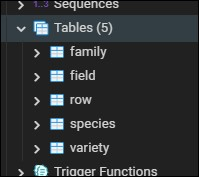
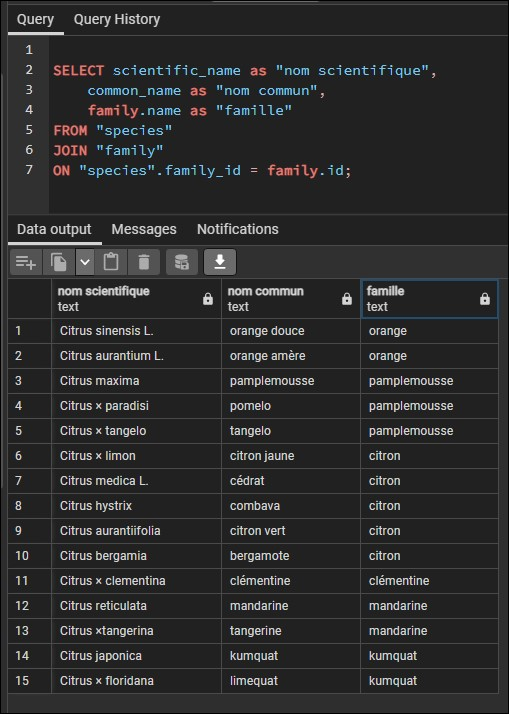
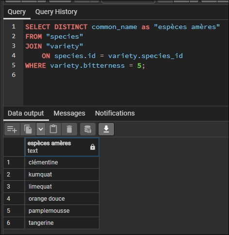
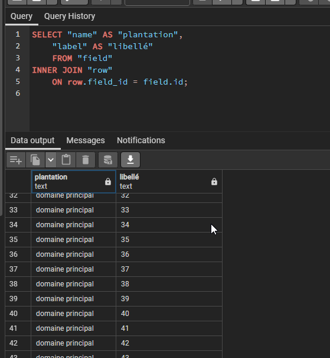
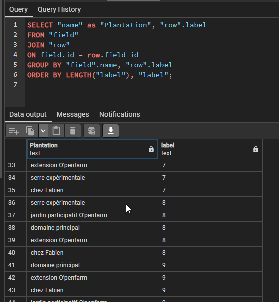
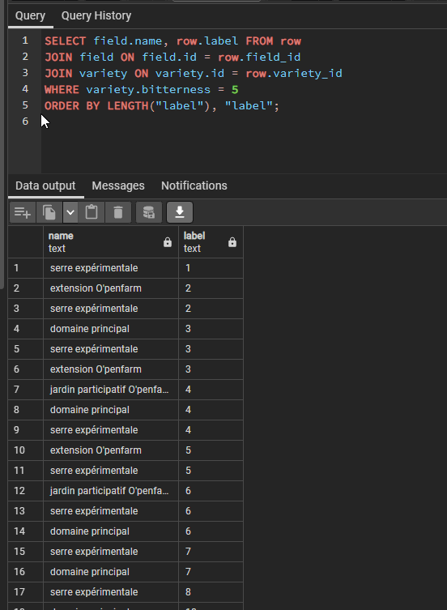
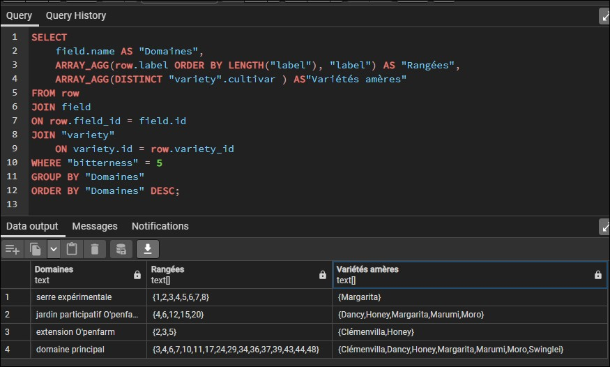
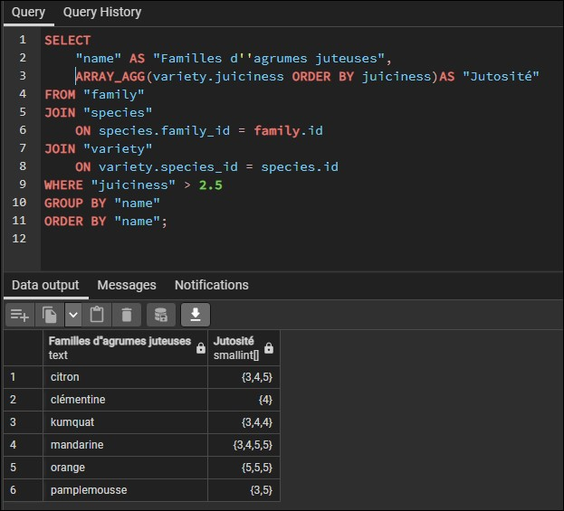

# Les besoins d'un fou d'agrumes Orangeraie

## Création de la base de données

Création de la base de données et import de ces données pour l'exercice

## Afficher le nom scientifique, le nom commun et la famille de toutes les espèces

## Afficher les espèces pour lesquelles il existe au moins une variété ayant une armertume de 5

## Afficher le nom de la plantation et le libellé des rangées concernées (une ligne par rangée)

## Ici juste une requête pour classer en fonction des rangées

## Afficher le nom de la plantation et le libellé des rangées concernées par l'amertume de 5 (une ligne par rangée)

## Regrouper par plantation

## Liste des plantations qui produisent de la mandarine

