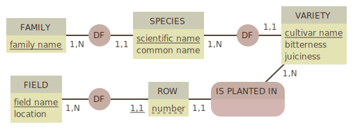

# Les besoins d'un fou d'agrumes

Les jointures, c'est sympa; Mais alors les sous-requêtes et cette notion de table virtuelle... :boom::dizzy_face:

Pas de panique ! On va s'entraîner un peu sur une base de données qui recense les plantations d'une orangeraie. Ouais, rien que ça.

## Le modèle

Beaucoup de relations mais aucune complexe et que des petites tables (en termes de nombre de colonnes) : parfait pour s'entraîner :ok_hand:

Côté _géographie_, la répartition des informations est très simple :
- La table `field` représente les différentes plantations (= les différentes zones géographiques)
- La table `row` recense les rangs de chaque plantation, sachant que sur un même rang, on ne plante qu'un cultivar (kézako ? je vais y venir)

Côté _agrumes_, on ne plaisante pas sur la classification. Dans une orangeraie, on ne fait pas pousser que des oranges, loin de là. On fait pousser des cultivars, c'est-à-dire des variétés d'une espèce. Et pour que ça parle aux clients, on classe les espèces par famille :
- La table `family` contient donc 6 grandes familles d'agrumes communément admises
- La table `species` recense les espèces cultivées dans l'orangeraie
- La table `variety` précise les cultivars de chaque espèce (certaines n'en ont qu'un seul de cultivé ici)

Tout ça nous donne une base qui assure la traçabilité de l'exploitation. Mais personne à l'orangeraie ne sait écrire de SQL et faut bien avouer que ces tables, lues séparément, c'est pas le kif.

On va donc écrire une poignée de requêtes que les intéressés n'auront plus qu'à exécuter pour avoir les infos qu'ils recherchaient. Dans un fichier `requetes.sql` à côté de ce readme, tout simplement.

## Quelques sous-requêtes

- Les clients de l'orangeraie ont tendance à dire que leurs clémentines ne sont pas juteuses :angry: Mais qu'est-ce qu'ils en savent, hein, d'abord ? Bon, on devrait bien pouvoir écrire une requête pour déterminer une bonne fois pour toute quelles familles ne contiennent aucune **espèce** ayant une jutosité **moyenne** supérieure à la moyenne (2.5, vu qu'on les note de 0 à 5).

Un peu d'aide ?

Procédons par étape :

1. Calculer la jutosité moyenne d'une espèce, c'est à dire la jutosité moyenne des cultivars groupés par espèce
2. Filtrer ces moyennes pour ne récupérer que celles supérieures à 2.5
3. Ne conserver que les _id_ de cette requête => on a notre première sous-requête
4. Sélectionner les espèces dont l'_id_ se trouve dans le résultat de cette sous-requête
5. Ne conserver que les _family_id_ de cette requête => on a une deuxième sous-requête
6. Sélectionner le nom de toute famille dont l'id ne se trouverait pas dans le résultat de cette sous-requête => voilà la liste des familles _non juteuses_

Spoiler

Ah bon ben ok, elles sont pas juteuses, les clémentines de l'orangeraie. :pray:

- Demande urgente d'un gestionnaire : il lui faudrait la liste des plantations qui produisent de la mandarine, peu importe l'espèce. Même si ce n'est que sur un rang dans une petite plantation isolée, il faut qu'elle y figure.

Un peu d'aide ?

On a 2 infos à croiser ici et elles se trouvent aux 2 extrémités du schéma :grimacing:

1. Retrouvons l'id correspondant à la famille 'mandarine', ce sera notre première sous-requête
2. À partir de cet id, parcourons successivement les espèces puis les cultivars correspondants, en retournant à chaque fois un lot d'id
3. Ce lot d'id va nous permettre de repérer les rangées qui en font pousser
4. Mais ce n'est pas l'id des rangées qui va nous intéresser ici, mais le _field_id_, car on veut identifier les plantations concernées
5. Maintenant qu'on a ces id, on peut récupérer les noms et localisations correspondantes.

Pfiou, 5 niveaux de requêtes imbriquées :sweat_smile:

## Quelques jointures

- Commençons simplement, affichons le nom scientifique, le nom commun et la famille de toutes les espèces.
- Affichons maintenant les espèces pour lesquelles il existe au moins une variété ayant une amertume de 5 (sur 5, autant dire que ça ne sert qu'à faire du vinaigre)
- Ah, il y a un doublon dans la requête précédente, c'est moche. La même sans doublon, siouplait :pray:
- Et ils sont plantés où, ces _cultivars à vinaigre_ ? Affichons le nom de la plantation et le libellé des rangées concernées (une ligne par rangée)
- Aïe, ça fait plein de lignes :see_no_evil: J'ai entendu parler d'une fonction `array_agg` qui permet de représenter un ensemble de valeurs sous forme de tableau, on pourrait peut-être grouper par plantation et ne présenter qu'une ligne par plantation ?

## L'un ou l'autre

Ce qu'on peut écrire avec des sous-requêtes, on peut l'écrire avec des jointures. Et vice versa. Mais pas tout le temps. Et on peut joindre des _vraies_ tables à des sous-requêtes. Tout comme des sous-requêtes peuvent inclure des jointures :dizzy_face:

Mais sauf si c'est vraiment nécessaire de coupler les deux, on préférera toujours l'un ou l'autre. Ne serait-ce que pour la lisibilité.

En parlant de lisibilité, je vous propose de réécrire la requête des plantations de mandarine avec des jointures. Pour voir si c'est plus lisible :slightly_smiling_face: